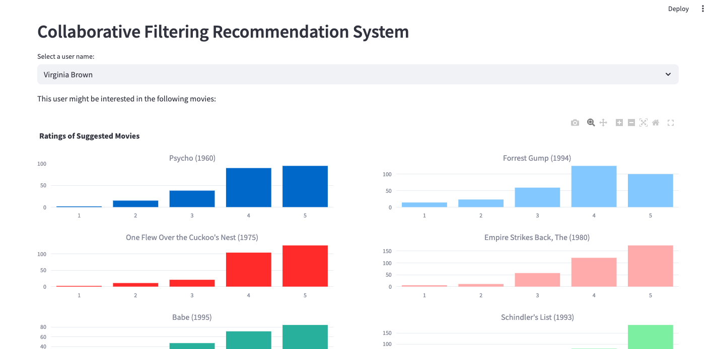

# Movie-Recommender-Collaborative-Filtering
Hi, with this repo, I provide a simple code for user-similarity based movie recommendation and a basic streamlit app to see the results. Select the user and you can see the top 10 recommendations and ratings histogram per recommendation.

## Installation and Running Instructions

You will require python 3.11 or higher to run this application.

1. First, create a python environment using your system python as follow and activate it.

> python -m venv app_env
> source app_env/bin/activate

2. Install the required packages using the requirements.txt as follow:-

> pip install -r requirements.txt

3. To run the application, use the streamlit package as follow:-

> streamlit run app.py
